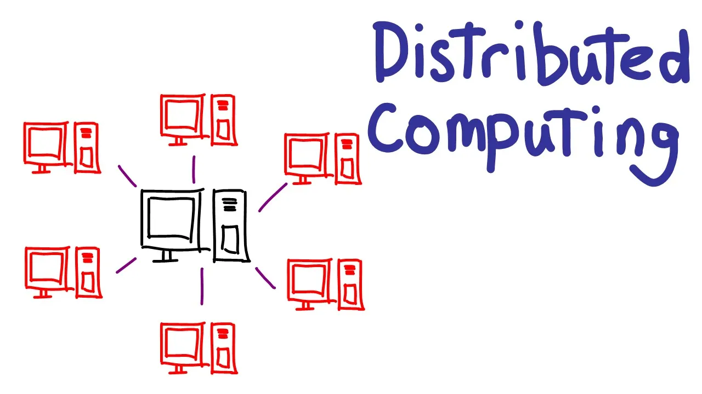

## Introduction

### Why distributed systems are crucial in today’s tech landscape ?

Modern computing architectures are becoming increasingly complex with the growing demand for processing power, resources, and the proliferation of devices, alongside the advancements in artificial intelligence (AI).

To support these advancements, we need systems that are more scalable and fault-tolerant. This is where distributed systems come into play.

### purpose of the blog :

As an enthusiast of distributed computing, I have always sought out the best resources for learning and building distributed systems. In this blog, I aim to consolidate these invaluable resources into one place, which i have used in learning so far, providing a comprehensive guide for those passionate about distributed computing like myself.

### Overview :

As a software engineer with a passion for building scalable web applications that improve people’s daily lives, I’ve always been intrigued by the underlying technologies that power large-scale systems. Recently, during the IPL matches in India, I was astounded by the sheer number of viewers — reaching up to 620 million — watching simultaneously without any interruptions. This remarkable feat sparked my interest in Content Delivery Networks (CDNs) and the architecture of these robust systems.

Driven by curiosity, I embarked on a journey to learn about distributed systems, exploring how they are built and operate. In this blog series, I aim to share the knowledge and insights I’ve gained so far, providing valuable resources for fellow enthusiasts eager to dive into the world of distributed computing.

## Understanding the Basics

### Definition:

Distributed systems are networked systems of independent computers that appear to users as a single coherent system. These systems spread processes and resources across multiple computers.

*Example:*

A simple example is the Google search engine. While it appears to users as a single machine, it actually operates on numerous interconnected machines. Users are unaware of the underlying complexity; what matters to them is receiving search results upon clicking the search button.

### Importance and key concepts:

*Scalability:*

Scalability is one of the most fundamental concepts in building distributed systems. It’s the ability of a system to handle increased loads by adding resources, such as servers and nodes, to the application based on the business logic. Distributed systems achieve this through horizontal scaling, where new machines are added to the network to manage the workload effectively.

*Fault Tolerance:*

When running a large-scale product or application, it’s inevitable that not all servers will work at the same pace, and there will be occasional failures and issues. These failures can impact business operations. To mitigate this, distributed systems are designed with fault tolerance in mind. They achieve fault tolerance by replicating data and processes across multiple nodes, ensuring high availability and reliability. This way, the system can continue functioning smoothly even when some components fail.

*Concurrency:*

Imagine a scenario where many people are accessing a particular site simultaneously, such as checking the results of a competitive examination. The server needs to handle requests from multiple clients at the same time. Distributed systems manage concurrency by coordinating processes running on different nodes to ensure they work together seamlessly and efficiently. This coordination allows the system to handle multiple simultaneous requests without compromising performance.

*Consensus Algorithms:*

Imagine a group of friends trying to decide on a restaurant for dinner. If some friends are unavailable or don’t respond, and the rest can’t agree on a single place, they won’t reach a conclusion. Similarly, in distributed systems, nodes (like those friends) must agree on certain actions or data values to process requests or perform functions. To avoid conflicts and ensure smooth operation, distributed systems use consensus algorithms. Common consensus algorithms include Paxos, Raft, and Byzantine Fault Tolerance (BFT). These protocols help achieve data consistency and coordination across the system, ensuring all nodes work together effectively.

## My Learning Journey:

### First Steps:

Just a heads-up: This is my personal way of learning distributed systems. What works for me might not work for you. Use this as a guide, but feel free to tweak it to fit your own learning style and preferences.

I began my journey with the open-source courses on Distributed Systems and Operating Systems (CmpSci - 677) from UMass Amherst by Professor Prashant Shenoy. He provides all the resources, including YouTube videos of the classes and notes for each session. Professor Shenoy is an excellent teacher and explains the concepts very well. I referred to his videos to build my foundational knowledge. Additionally, I checked out [MIT’s 6.824 course](https://www.youtube.com/@6.824), which is also available on YouTube, to further enhance my understanding.

I also referred to two key books: Designing Data-Intensive Applications by Martin Kleppmann and Distributed Systems by Andrew Tanenbaum, which provided in-depth knowledge and valuable insights into the principles and practices of distributed systems. Additionally, I read numerous blog posts on Medium covering specific topics. I’ll keep adding more of these resources here shortly.

I also referred to two key books: Designing Data-Intensive Applications by Martin Kleppmann and Distributed Systems by Andrew Tanenbaum, which provided in-depth knowledge and valuable insights into the principles and practices of distributed systems. Additionally, I read numerous blog posts on Medium covering specific topics. I’ll keep adding more of these resources here shortly.

And of-course chatGPT’d a lot of stuff to understand better.

### Building a Strong Foundation and understanding:

These are the key concepts I believe are valuable for getting started building distributed systems:

1. Networking Fundamentals
2. Consensus Algorithms (Paxos, RAFT)
3. Storage Systems
4. Load Balancing

As a software engineer, I believe the best way to learn something is to implement and write code with your own hands rather than just learning the concepts and reading about it.

To start implementing, I suggest beginning with a distributed key-value store on your local machine. Use sockets to make the nodes connect to each other and communicate. This will help you understand concurrency, thread programming, and replication. You can use HashiCorp’s memberlist to achieve this.

### Hands-On

Firstly, I started with learning Go (Golang). I wasn’t a complete beginner, as I had some experience with it from my previous work. Go is particularly helpful in building distributed systems for several reasons compared to other languages:

1. *Concurrency:* Go provides robust support for concurrent programming with goroutines and channels, making it easier to handle multiple tasks simultaneously.
2. *Performance:* As a compiled language, Go offers excellent performance with fast execution times and efficient memory usage, which is crucial for distributed systems.
3. *Simplicity:* Go’s syntax is simple and clean, reducing the complexity of codebases and making it easier to write, read, and maintain distributed system applications.
4. *Standard Library:* Go’s standard library includes extensive support for network programming and other essential tools, accelerating the development of distributed systems.

I started with implementing a Remote Procedure Call (RPC) library, which helped me learn about serialization, stubs, and how to send messages between the client and server. I used goroutines, channels, and gob for encoding and decoding.

Later, after gaining good knowledge, I built a key-value store using various distributed systems concepts such as concurrency, replication, and fault tolerance. I then implemented the RAFT algorithm, which helped me learn about log replication, fault tolerance, the Heartbeat mechanism, and leader election. Following this, I built my own file storage system, further enhancing my understanding and skills in distributed systems.

Currently working on more exciting projects.

references i used for RPC and RAFT —

1. https://raft.github.io/raft.pdf
2. http://www.bitsavers.org/pdf/xerox/parc/techReports/CSL-83-7_Implementing_Remote_Procedure_Calls.pdf
3. youtube channel — https://www.youtube.com/@anthonygg_
4. youtyube channel - https://www.youtube.com/playlist?list=PLacuG5pysFbBpWHfKUU9Dfdk8RmQ7B9EH

Thanks for sticking along and reading till here, I will add more content as i learn and build more projects. If anyone wants to start learning systems, i would suggest

 - Start with the basics and gradually move to more complex topics.
 - Don’t just read — implement and experiment with code.
 - Utilize online courses, books, and blog posts to build your knowledge.
 - Join communities and forums to discuss your ideas and get feedback.

Will share more intresting insights from Distributed systems and cloud shortly

I invite you to share your experiences or ask any questions in the comments below. Let’s learn and grow together in the fascinating world of distributed systems!
