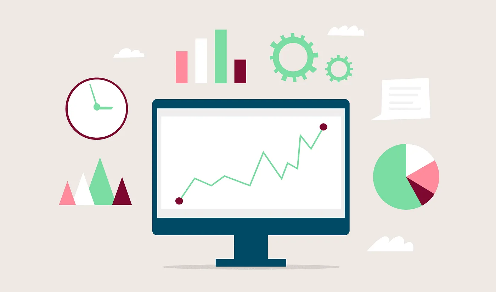
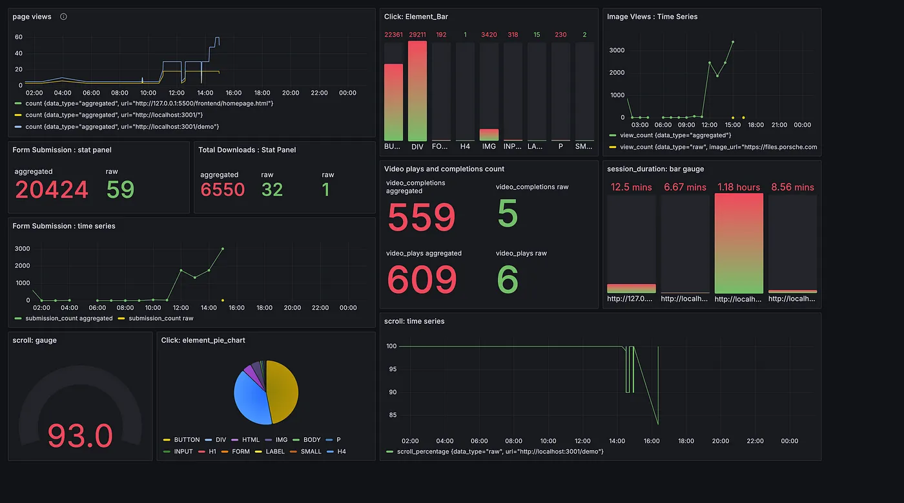

## Introduction

I have always wondered how Amazon or any shopping website consistently masters the art of placing the right products in the perfect spot on the screen. They skillfully guide you to their “sweet spot,” ensuring you see whatever they want to sell — whether you’re interested in buying it or not. These sites are so effective at implanting the idea of owning a product that it becomes hard to resist.

This curiosity led me to explore real-time analytics and data-driven projects. The concept intrigued me so much that I decided to dive in and build a project of my own. While I know there are many big players in this field, I was eager to learn the underlying concepts of real-time data transactions and the system design that powers them.

Note — This project was only built to understand how real time sysmtems and time series databases work.

### Overview :

**WebWatch** — A real-time website analytics tool built with distributed systems concepts and technologies. It tracks user interactions on your webpage, providing valuable insights that help improve content and engagement. I developed this tool to capture various user behaviors such as page views, scroll depth, clicks, form submissions, and more.

The tech stack includes Golang (my preferred choice for building high-performance, concurrent applications), Apache Kafka for message brokering and stream processing, InfluxDB for time-series data storage, and Grafana for data visualization.

To start using the service, website owners simply embed a tracking.js script into their *<html>*. This script monitors user interactions and sends the data to the server for processing and storage, offering comprehensive real-time insights.

#### Key Interactions Tracked:

 - **Page Views:** Monitors which pages are being viewed and how often.
 - **Clicks:** Tracks clicks on various elements, helping understand user interaction with the website.
 - **Form Submissions:** Captures when users submit forms, such as sign-up forms or contact forms.
 - **Scroll Depth:** Measures how far users scroll down each page, indicating content engagement.
 - **Cursor Movements:** Records cursor activity, showing where users are focusing their attention.
 - **Video Plays/Completions:** Analyzes user interaction with video content, including plays and completions.
 - **Downloads:** Monitors file download activity from the site.
 - **Image Views:** Tracks which images are being viewed and when.
Working on to add more events

#### Backend Setup and data storage:

The backend of WebWatch is built using Golang, which handles data ingestion, processing, and integration with Apache Kafka for event streaming. Kafka Producers send events to various topics based on the interaction type, while Kafka Consumers process these events and store the data in InfluxDB, a time-series database optimized for real-time data.

 - **Data Storage:** InfluxDB stores both raw and aggregated data, enabling efficient querying and analysis. Aggregated data is particularly useful for long-term trend analysis, while raw data provides granular insights into specific user interactions.
 - **Visualization:** Grafana is used to create dynamic dashboards that visualize the data collected. These dashboards provide real-time insights and historical trends, making it easy for website owners to monitor and analyze user behavior.

### Understanding the Tracking Mechanism:

Lets dive into the details of how the interactions are tracked.

When the project is hosted, the `tracking.js` script is exposed, containing JavaScript functions that leverage DOM manipulation and event handlers. When a user performs an event—such as clicking a button or any DOM element—the associated event listener detects the action. This triggers a function, such as `trackClick`, which records details including the clicked DOM element, its position on the x and y axes of a Cartesian plane, the timestamp, and the userId. This data is then sent to an endpoint, such as `http://localhost:8080/track`, which is exposed by the server.

trackClick :

```js
const trackClick = (event) => {
    if (!isFieldFocused) {
      const data = {
        type: "click",
        x: event.clientX,
        y: event.clientY,
        target: event.target.tagName,
        userId: getUserId(),
        timestamp: new Date().toISOString(),
      };
      sendData(data);
    }
    isFieldFocused = false;
  };

  window.addEventListener("click", trackClick);
```

Similarly, there are methods for each type of event, responsible for tracking specific interactions.

Once the data arrives at the backend, it is processed using Apache Kafka. The system uses a producer-consumer model where the data from the script is marshaled into a Go struct called `Event` and sent to the Kafka producer. The producer writes the message into its respective Kafka topic. The data is then collected by a Kafka consumer, processed, and aggregated. The consumer uploads the data to a time-series database, InfluxDB, both in real-time and after aggregation. The data is differentiated by setting `data_type` to either `"raw`" or `"aggregated"`. In this setup, aggregation occurs every 10 seconds.

Event struct defined:

```go
type Event struct {
 Type            string    `json:"type"`                        // Type of event: pageview, click, duration, scroll, mousemove, hover, form_submission, etc.
 URL             string    `json:"url,omitempty"`               // The URL where the event occurred
 Referrer        string    `json:"referrer,omitempty"`          // Referrer URL (for pageview events)
 UserID          string    `json:"userId"`                      // Unique identifier for the user
 Timestamp       time.Time `json:"timestamp"`                   // Timestamp when the event occurred
 X               int       `json:"x,omitempty"`                 // X-coordinate (for click, mousemove events)
 Y               int       `json:"y,omitempty"`                 // Y-coordinate (for click, mousemove events)
 Target          string    `json:"target,omitempty"`            // Target element (for click, hover events)
 ScrollPercentage int      `json:"scrollPercentage,omitempty"`  // Scroll depth as a percentage (for scroll events)
 Duration        int       `json:"duration,omitempty"`          // Duration in seconds (for duration, idle time events)
 ElementID       string    `json:"elementId,omitempty"`         // ID of the element (for hover, form, field events)
 ClassName       string    `json:"className,omitempty"`         // Class name of the element (for hover, form events)
 FieldName       string    `json:"fieldName,omitempty"`         // Name of the form field (for field focus/blur events)
 FormID          string    `json:"formId,omitempty"`            // ID of the form (for form submission events)
 FormClassName   string    `json:"formClassName,omitempty"`     // Class name of the form (for form submission events)
 Language        string    `json:"language,omitempty"`          // User's preferred language setting
 TimeZone        string    `json:"timeZone,omitempty"`          // User's time zone
 ScreenResolution string   `json:"screenResolution,omitempty"`  // Screen resolution of the user's device
 VideoID         string    `json:"videoId,omitempty"`           // ID of the video element (for video play/completion events)
 VideoURL        string    `json:"videoUrl,omitempty"`          // URL of the video (for video play/completion events)
 AudioID         string    `json:"audioId,omitempty"`           // ID of the audio element (for audio play events)
 AudioURL        string    `json:"audioUrl,omitempty"`          // URL of the audio (for audio play events)
 DownloadURL     string    `json:"downloadUrl,omitempty"`       // URL of the downloaded file (for download events)
 ImageURL        string    `json:"imageUrl,omitempty"`          // URL of the viewed image (for image view events)
}
```

Processing event with Consumer:

```go
func processEvent(event models.Event) {
 mu.Lock()
 defer mu.Unlock()

 switch event.Type {
 case "pageview":
  db.StorePageViewData(event.URL, 1)
  pageViewCounts[event.URL]++

//   Other cases
 }
}
```
Storing it to DB in real time and after aggregating:

```go
func StorePageViewData(url string, count int) {
 storeData("pageviews", map[string]string{"url": url, "data_type": "raw"}, map[string]interface{}{"count": count})
}


func AggregatePageViewData(url string, count int) {
 storeData("pageviews", map[string]string{"url": url, "data_type": "aggregated"}, map[string]interface{}{"count": count})
}
```

Once the data is stored in InfluxDB, it can be used for various visualizations. The Grafana dashboard fetches the data every 5 seconds to provide near real-time insights. To achieve true real-time updates, a WebSocket connection can be established between the client (dashboard) and the server, allowing for continuous, live updates of the data being visualized.

Grafana Visualisation:



### Future Enhacements:

1. **User Authentication:** Enable secure sign-up and login, allowing multiple users to access the service, manage profiles, and ensure data privacy.

2. **Multi-tenant Support:** Allow users to create and manage their own dashboards, ensuring data isolation and customization, with role-based access control for admins.

3. **Advanced Analytics:** Implement machine learning for predictive insights, anomaly detection, and recommendations to enhance data-driven decision-making.

4. **Scalability:** Deploy on AWS/GCP with load balancing, auto-scaling, and managed services to ensure the platform handles increasing traffic efficiently. (Only if i get funds to do this lol)

5. **Custom Dashboard:** Create a responsive, interactive dashboard using React and Three.js, with real-time updates and customizable widgets for an enhanced user experience.

6. Bring in Community to develop and contribute this and open source the solution


### Conclusion

Tracking user interactions on your website is crucial for understanding visitor behavior and improving user experience. WebWatch offers a real-time analytics tool built with distributed systems technologies. By implementing this tool, you gain valuable insights that can drive meaningful improvements to your website’s content and user engagement.

I encourage you to clone the WebWatch repository, explore the code, and implement the tracker on your own website. It’s a great way to see firsthand how real-time analytics can enhance your understanding of user behavior.

Feedback and contributions are always welcome! Whether you have ideas for new features, improvements, or just want to share your experience using WebWatch, your input can help make this project even better.

This project was solely done to experiment with Apache Kafka and visualisation tools

Github Repo — https://github.com/akhilk2802/WebWatch 

Thank you for reading till here, I have just started writing on this amazing platform, Lets learn and grow together.

Please share if you like the content.
