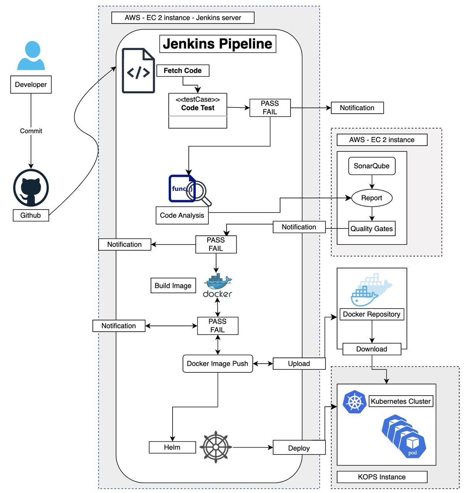

## Architecture diagram

1. Built a Monorepo Based microservices architecture Project, with utility specific services
2. Developed multiple microservices, with the auth-service implemented using NodeJS and MongoDB
3. Dockerized the microservices for consistent and isolated execution environments
4. Implemented a Jenkins pipeline to automate the process of code fetching, dependency installation, testing, static code analysis with SonarQube, Docker image building, and deployment.
5. Integrated SonarQube for comprehensive code quality and security checks.
6. Deployed services using Helm charts to a Kubernetes cluster managed by Kops, enabling scalability and high availability.

