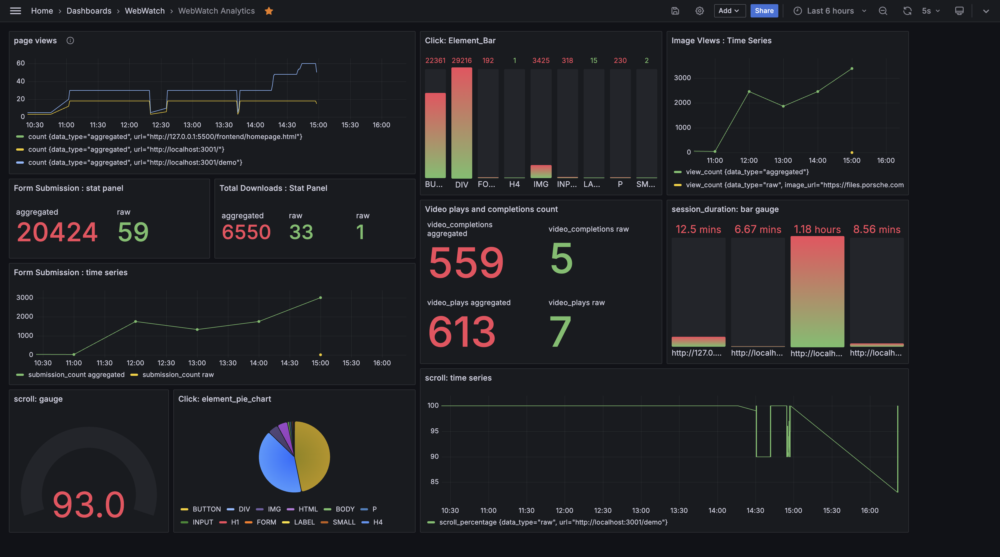

## Visualisation:

Built is a sophisticated tool for capturing and analyzing real-time user interactions on websites. Built with Golang, InfluxDB, and Apache Kafka, it provides detailed insights into user behavior, including page views, clicks, scroll depth, mouse movements, and form interactions.

Key Features:
1. Real-Time Data Capture: Tracks user interactions such as page views, clicks, scrolls, and media plays in real-time.
2. Data Aggregation: Aggregates raw data every 10 seconds for efficient analysis and reporting.
3. Visualization: Integrates with Grafana for customizable dashboards displaying time-series data, heatmaps, and more.
4. Scalable Architecture: Designed using microservices, ensuring high scalability and reliability.
5. Technologies: Golang, InfluxDB, Apache Kafka, Grafana, React.

Impact: Provides actionable insights for optimizing user experience and boosting engagement on websites