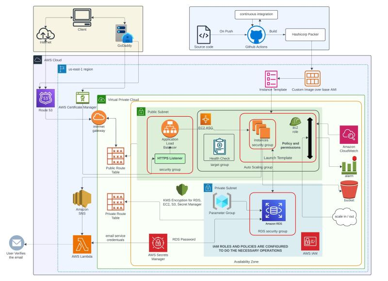

## Architecture Diagram

Developed a cloud-native web application leveraging modern cloud principles to ensure scalability, automation, and security. Designed an end-to-end solution with advanced cloud infrastructure management, event-driven functions, and continuous integration and delivery (CI/CD).

1. Automated Infrastructure: Provisioned VPC, EC2, RDS, and S3 using Terraform, ensuring reliability, consistency, and scalability across different environments.
2. Serverless Functions: Built event-driven functions with AWS Lambda for efficient task execution and service integration.
3. CI/CD Pipeline: Set up a fully automated CI/CD pipeline enabling seamless deployments, testing, and infrastructure updates.
4. Secure Email Verification: Implemented token-based email verification for safe user onboarding and authentication.
5. Data Security: Applied SSL encryption for secure data transmission and customer-managed encryption keys for data protection.
6. Monitoring & Scaling: Built observability with real-time logging and auto-scaling configurations to manage dynamic workloads effectively.

Skills: Amazon Web Services (AWS) · Cloud Computing · Node.js · AWS Lambda · Docker · AWS Auto Scaling · load balancer · PostgreSQL