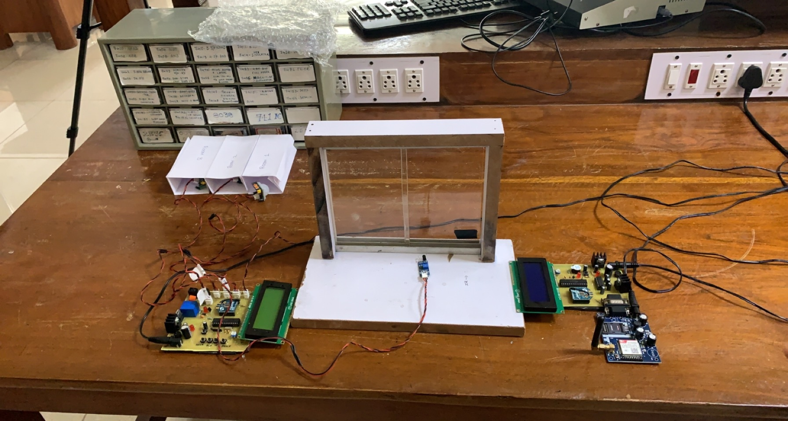

<!--  -->

- Developed a prototype of home security system, which includes 3 sensors - PIR sensor, temperature sensor and proximity sensor, 
-  On detecting any threats, through GSM module, the notification is sent directly on your registered mobile phone.

